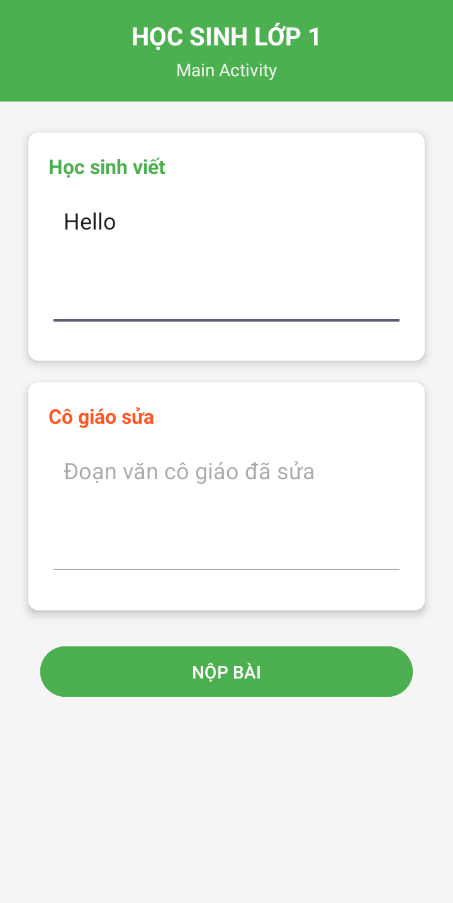

# Ứng dụng Sửa bài Chính tả

Ứng dụng Android đơn giản giúp học sinh lớp 1 nộp bài chính tả và nhận phản hồi từ cô giáo với giao diện trực quan, thân thiện.

## Mô tả

Ứng dụng "Sửa bài Chính tả" được phát triển nhằm mô phỏng quá trình học sinh lớp 1 nộp bài tập chính tả và cô giáo sửa bài. Ứng dụng bao gồm hai màn hình chính:

- **Màn hình Học sinh**: Nơi học sinh nhập đoạn văn và xem kết quả đã được cô giáo sửa
- **Màn hình Cô giáo**: Nơi cô giáo nhận bài và thực hiện việc sửa lỗi chính tả

Ứng dụng sử dụng kiến thức về vòng đời Activity, Intent và startActivityForResult để truyền dữ liệu giữa các màn hình, đảm bảo luồng công việc mượt mà và hiệu quả.

## Tính năng chính

- Giao diện thân thiện, dễ sử dụng cho cả học sinh và giáo viên
- Học sinh có thể nhập đoạn văn cần kiểm tra chính tả
- Giáo viên có thể sửa lỗi chính tả trong đoạn văn của học sinh
- Học sinh nhận được phản hồi với đoạn văn đã được sửa
- Chuyển đổi mượt mà giữa các màn hình với hiệu ứng trực quan

## Hình ảnh minh họa

### Quá trình sửa bài chính tả

| Học sinh nhập đoạn văn | Cô giáo sửa bài | Kết quả đã sửa |
|:-------------:|:----------------:|:----------------:|
|  |  |  |

## Cấu trúc ứng dụng

Ứng dụng bao gồm hai màn hình chính:

1. **MainActivity (Học sinh lớp 1)**: Màn hình cho học sinh nhập đoạn văn và xem kết quả đã sửa
2. **SecondActivity (Cô giáo dạy chính tả)**: Màn hình cho cô giáo sửa đoạn văn của học sinh

## Luồng dữ liệu

1. Học sinh nhập đoạn văn vào ô "Học sinh viết"
2. Khi nhấn nút "NỘP BÀI", đoạn văn được gửi đến màn hình của cô giáo (REQUEST_CODE: 99)
3. Cô giáo sửa đoạn văn trên màn hình của mình
4. Khi nhấn nút "ĐÃ SỬA BÀI", đoạn văn đã sửa được gửi lại màn hình học sinh (RESULT_CODE: 88)
5. Học sinh xem đoạn văn đã được sửa trong ô "Cô giáo sửa"

## Yêu cầu hệ thống

- Android 5.0 (API level 21) trở lên
- Android Studio

## Cách cài đặt

1. Clone repository này về máy local
2. Mở dự án bằng Android Studio
3. Sync Gradle và build project
4. Chạy ứng dụng trên thiết bị thật hoặc máy ảo

## Công nghệ sử dụng

- Java
- Android SDK
- LinearLayout và CardView
- Activity Lifecycle
- Intent và startActivityForResult

## Thiết kế giao diện

- Sử dụng CardView để tạo giao diện hiện đại, có bóng đổ
- Phối màu thống nhất: xanh lá (#4CAF50) cho học sinh, đỏ cam (#FF5722) cho cô giáo
- Tiêu đề và nhãn được làm nổi bật với chữ in đậm
- Vùng nhập liệu đa dòng cho phép nhập và sửa đoạn văn dễ dàng

## Giấy phép

Dự án được phân phối dưới giấy phép MIT. Xem file `LICENSE` để biết thêm chi tiết.

## Tác giả

© 2025 - Được phát triển bởi Eggpant203 🍆

---

_Lưu ý: Đây là dự án học tập, mô phỏng quá trình sửa bài chính tả trong lớp học. Mọi đóng góp và phản hồi đều được chào đón._